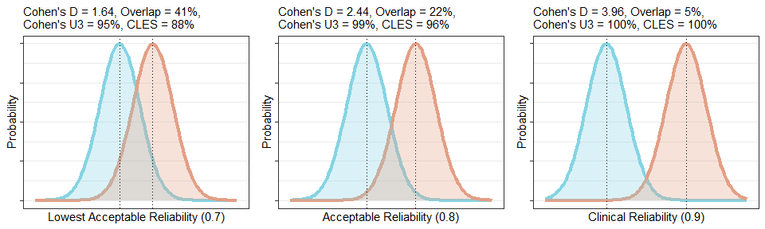

<!-- README.md is generated from README.Rmd. Please edit that file -->
relfeas
=======

The goal of relfeas is to allow researchers to use reliability reported in test-retest studies to make assessments of the feasibility of new study designs. This R package accompanies the preprint: [We need to talk about reliability: Making better use of test-retest studies for study design and interpretation](https://www.biorxiv.org/content/early/2018/03/06/274894).

**Note:** The package is still a bit rough around the edges on some functions. If you find anything wrong, ugly, or that I've not included something obviously useful which would follow from anything presented, please don't be shy about letting me know in the Issues or by mail at mathesong\[at\]gmail.com

Installation
------------

You can install relfeas from github with:

``` r
# install.packages("devtools")
devtools::install_github("mathesong/relfeas")
```

### Examples from the paper

Below, I detail the calculations performed in the manuscript, and show the code used from the package. Please refer to the manuscript for the context

``` r
library(relfeas)
library(tidyverse)
library(ggplot2)
library(gridExtra)
library(pwr)
library(knitr)
```

#### Example 1

**Summary:** this example shows how the reliability of a test-retest validation study with low inter-individual variance and low reliability can be approximated for an applied study with higher inter-individual variance. This shows that despite the low reliability estimated in the test-retest study, this measurement demonstrates high reliability for the research question in the applied study.

``` r
sd2extrapRel(sd=0.32, icc_original = 0.32,
              sd_original = 0.10)
#> [1] 0.9335938
```

Even if the measurement error were to double due to the use of partial volume effect correction in the applied study (an extreme assumption), this conclusion would still hold.

``` r
sd2extrapRel(sd = 0.32,icc_original =  0.32,
              sd_original =  0.10, tau = 2)
#> [1] 0.734375
```

#### Example 2

**Summary:** this example shows how the reliability of measurements has enormous implications for power analysis when planning a study. In this example, both measures show reliability ≥ 0.7, but when the reliability of these measures is taken into consideration during power analysis, the minimal required sample size for this research question (more details in the paper) is nearly doubled.

``` r
r_attenuation(0.8, 0.7)
#> [1] 0.7483315

pwr::pwr.r.test(r=sqrt(0.3), power=0.8)
#> 
#>      approximate correlation power calculation (arctangh transformation) 
#> 
#>               n = 23.00936
#>               r = 0.5477226
#>       sig.level = 0.05
#>           power = 0.8
#>     alternative = two.sided

pwr::pwr.r.test(r=sqrt(0.3)*r_attenuation(0.8, 0.7), power=0.8)
#> 
#>      approximate correlation power calculation (arctangh transformation) 
#> 
#>               n = 43.57966
#>               r = 0.409878
#>       sig.level = 0.05
#>           power = 0.8
#>     alternative = two.sided
```

#### Example 3

**Summary:** reliability of individual measurements, or showing the robustness of within-individual effects is often, mistakenly, taken as a proxy for good reliability of assessing between-individual differences in within-individual effects ([see the excellent paper by Hedge, Powell and Sumner 2017](https://link.springer.com/article/10.3758/s13428-017-0935-1)). Here we demonstrate this for this particular application.

Characteristics of the sample:

``` r
# Sample characteristics

meanbp <- 1.91
delta_mean <- -0.12 # Mean percentage change in difference study
delta_sd <- 0.1 # SD of percentage change in difference study
sem <- icc2sem(icc = 0.8, sd =  0.22)
delta_sd_trt <- 0.073 # SD of percentage change in test-retest study


# Characteristics across two measurements
sd = delta_sd*(meanbp)
(delta_icc <- sem2icc(sem*2, sd))
#> [1] -0.06137441
```

Within-individual effects:

``` r
# Smallest detectable difference: individual
(sdd_indiv <- 100*((sem*1.96*sqrt(2))/meanbp))
#> [1] 14.27826

# Smallest detectable difference: group
samplesize <- 2
(sdd_group <- 100*(((sem/sqrt(samplesize))*1.96*sqrt(2))/meanbp))
#> [1] 10.09626

# Within-individual power analysis
(power_n_within <- pwr::pwr.t.test(d= delta_mean/delta_sd_trt , sig.level = 0.05,
                                   type = "paired", alternative = "less",
                                   power=0.8))
#> 
#>      Paired t test power calculation 
#> 
#>               n = 4.014991
#>               d = -1.643836
#>       sig.level = 0.05
#>           power = 0.8
#>     alternative = less
#> 
#> NOTE: n is number of *pairs*
```

Between-individual assessment of within-individual changes

``` r
ss_total <- sumStat_total(n1 = 20, mean1 =  abs(delta_mean*meanbp), sd1 = delta_sd*meanbp,
              n2 = 20, mean2 = abs(2.5*delta_mean*meanbp), sd2=delta_sd*meanbp)

# Estimation of reliability
(delta_icc_patcntrl <- sem2icc(sem*2, ss_total$sd_total))
#> [1] 0.4120227

(d_true <- ss_total$d)
#> [1] 1.8

# Using this estimated reliability for estimation of attenuation
(d_meas <- d_attenuation(rel_total = delta_icc_patcntrl, d = d_true))
#> [1] 0.9509363

# Increase in the number of required participants after taking reliability into account
(pwr_increase_unpaired <- pwr::pwr.t.test(d=d_meas, power = 0.8, alternative = "greater")$n /
  pwr::pwr.t.test(d=d_true, power = 0.8, alternative = "greater")$n)
#> [1] 3.081688

(pwr_increase_paired <- pwr::pwr.t.test(d=d_meas, power = 0.8, type = "paired", alternative = "greater")$n /
  pwr::pwr.t.test(d=d_true, power = 0.8, type = "paired", alternative = "greater")$n)
#> [1] 2.281319
```

#### Example 4

**Summary:** A measurement outcome with high reliability but also high variance (e.g. PBR28 for translocator protein, TSPO) is less well suited for assessing small proportional changes within individuals than a measurement outcome with low variance, even if it has relatively low reliability (e.g. AZ10419369 for frontal cortex serotonin 1B receptors). However, larger proportional within-individual changes are more likely in the former due to the larger variance.

``` r
tspo_hab_10es <- 10/42
ser1b_10es <- 10/6

(tspo_n <- round(pwr::pwr.t.test(d = tspo_hab_10es, power = 0.8)$n))
#> [1] 278

(ser1b_n <- round(pwr::pwr.t.test(d = ser1b_10es, power = 0.8)$n))
#> [1] 7
```

#### Example 5

Variance reduction strategies (see paper) for PBR28 lead to new outcomes with poor reliability (see paper by [Matheson et al., 2017](https://ejnmmires.springeropen.com/articles/10.1186/s13550-017-0304-1)). Very large differences between groups are required before these new outcome measures begin to be reliable for applied research questions.

One can conceptualise the required Cohen's D in various ways to get an idea of whether or not such a large effect is or is not reasonable for a particular research question. ()

-   **d** Cohen's D
-   **u3** Cohen's U3
-   **overlap** Distributional overlap
-   **cles** Common Language Effect Size

(more details in the paper, or [here](http://rpsychologist.com/d3/cohend/))

``` r
#########
# Basic #
#########

(sd_basic <- extrapRel2sd(0.7, 0.5))
#> [1] 1.290994

d_basic <- sdtot2mean2(sd_total = sd_basic, n1 = 20, n2=20, mean1 = 1)

(es_basic <- cohend_convert(d=d_basic$d))
#> $d
#> [1] 1.643168
#> 
#> $u3
#> [1] 0.9498259
#> 
#> $overlap
#> [1] 0.4113138
#> 
#> $cles
#> [1] 0.8773609


##############
# Acceptable #
##############

(sd_acceptable <- extrapRel2sd(0.8, 0.5))
#> [1] 1.581139

d_acceptable <- sdtot2mean2(sd_total = sd_acceptable, n1 = 20, n2=20, mean1 = 1)

(es_acceptable <- cohend_convert(d=d_acceptable$d))
#> $d
#> [1] 2.439262
#> 
#> $u3
#> [1] 0.9926414
#> 
#> $overlap
#> [1] 0.2226048
#> 
#> $cles
#> [1] 0.9577199


############
# Clinical #
############

(sd_clin <- extrapRel2sd(0.9, 0.5))
#> [1] 2.236068

d_clin <- sdtot2mean2(sd_total = sd_clin, n1 = 20, n2=20, mean1 = 1)

(es_clin <- cohend_convert(d=d_clin$d))
#> $d
#> [1] 3.962323
#> 
#> $u3
#> [1] 0.9999629
#> 
#> $overlap
#> [1] 0.04757319
#> 
#> $cles
#> [1] 0.997459
```

We can also plot these effects to get a better idea of how they would look

``` r
graphtheme <- theme(axis.text.x=element_blank(),
                    axis.text.y=element_blank())

d_fig <- grid.arrange(
  plot_difference(d = d_basic$d) + 
    labs(x='Lowest Acceptable Reliability (0.7)', title=NULL, y='Probability') + 
    graphtheme,
  plot_difference(d = d_acceptable$d) + 
    labs(x='Acceptable Reliability (0.8)', title=NULL, y='Probability') + 
    graphtheme,
  plot_difference(d = d_clin$d) + 
    labs(x='Clinical Reliability (0.9)', title=NULL, y='Probability') + 
    graphtheme,
  nrow=1)
```



Note that the figure above, as well as the function to generate these figures and these alternative explanation metrics describing effect sizes, are inspired by the work of Kristoffer Magnusson, a.k.a. [R Psychologist](https://twitter.com/krstoffr), and his [interactive Cohen's D figure](http://rpsychologist.com/d3/cohend/) as well as his description of where [Cohen was wrong about overlap](http://rpsychologist.com/cohen-d-proportion-overlap).

### Other Examples

Not all the functions are used in the paper. Here a demonstrate a couple of others.

#### Effect Size Comparisons

It is extremely important to consider effect sizes when performing study design. For this purpose, I have included plotting functions such as in example 5 above. I have also included a conversion function for Cohen's D alternatives for converting between them if one feels more intuitive than another.

``` r
## If one wishes to know the true size of what a particular Cohen's D 
## represents (e.g. as a Common Language Effect Size)

cohend_convert(d = 1)
#> $d
#> [1] 1
#> 
#> $u3
#> [1] 0.8413447
#> 
#> $overlap
#> [1] 0.6170751
#> 
#> $cles
#> [1] 0.7602499

## If one wishes to know what the corresponding Cohen's D would be for
## an application for which the effect size can be more intuitively understood
## as a Common Language Effect Size for example

cohend_convert(cles = 0.8)
#> $d
#> [1] 1.190232
#> 
#> $u3
#> [1] 0.8830224
#> 
#> $overlap
#> [1] 0.5517659
#> 
#> $cles
#> [1] 0.8
```

#### Performing test-retest analysis

I have also included a test-retest analysis function which includes all the usual metrics which are reported in PET studies, as well as a few others which are useful. It also produces a tidy output, so it can be used with tidy data within R pipelines. I will use some data from the *agRee* package.

First we prepare the data into tidy format

``` r
data("petVT", package = 'agRee')

Region <- map_df(petVT, ~nrow(.)) %>% 
  gather(ROI, participants) %>% 
  group_by(ROI) %>% 
  map2(.x = .$ROI, .y = .$participants,.f = ~ rep(x = .x, times=.y)) %>% 
  do.call('c', .)

petVT <- do.call(rbind, petVT) %>% 
  as_tibble() %>% 
  rename(Measurement1=V1, Measurement2=V2) %>% 
  mutate(Region = Region) %>% 
  mutate(Participant = 1:n()) %>% 
  gather(Measurement, Outcome, -Participant, -Region)
```

Now the data looks as follows:

``` r
head(petVT)
#> # A tibble: 6 x 4
#>   Region   Participant Measurement  Outcome
#>   <chr>          <int> <chr>          <dbl>
#> 1 amygdala           1 Measurement1    38.1
#> 2 amygdala           2 Measurement1    24.7
#> 3 amygdala           3 Measurement1    20.4
#> 4 amygdala           4 Measurement1    29.9
#> 5 amygdala           5 Measurement1    18.3
#> 6 amygdala           6 Measurement1    23.3
```

Then we can perform a test-retest analysis for each separate study/outcome/region.

``` r
calc_trt <- petVT %>% 
  group_by(Region) %>% 
  nest() %>% 
  mutate(outcomes = map(data, ~ trt( data=.x, values='Outcome', 
                                     cases = 'Participant', rater = 'Measurement' )))

trt_out <- map_df(calc_trt$outcomes, 'tidy') %>% 
  mutate(Region = calc_trt$Region) %>% 
  select(Region, everything())

kable(trt_out, digits = 2)
```

| Region     |   mean|    sd|   cov|  skew|  kurtosis|   icc|  icc\_l|  icc\_u|  wscv|   sdd|  absvar|  signvar|  signvar\_sd|
|:-----------|------:|-----:|-----:|-----:|---------:|-----:|-------:|-------:|-----:|-----:|-------:|--------:|------------:|
| amygdala   |  27.53|  6.18|  0.22|  0.10|     -1.43|  0.95|    0.83|    0.99|  0.05|  3.98|    0.06|    -0.02|         0.08|
| cerebellum |  12.26|  1.37|  0.11|  0.16|     -1.40|  0.83|    0.29|    0.97|  0.05|  1.65|    0.06|     0.03|         0.07|
| brainStem  |   0.79|  0.27|  0.35|  0.24|     -1.41|  0.36|   -0.29|    0.79|  0.28|  0.61|    0.30|    -0.01|         0.40|

The table lists the following for each sample:

##### Distribution

-   **mean**: Mean
-   **sd**: Standard deviation
-   **cov**: Coefficient of variation
-   **skew**: Skew
-   **kurtosis**: Kurtosis

##### Reliability

-   **icc**: ICC
-   **icc\_l**: Lower bound of the 95% confidence interval of ICC
-   **icc\_u**: Upper bound of the 95% confidence interval of ICC

##### Measurement Imprecision

-   **wscv**: Within-subject coefficient of variation: relative imprecision
-   **sdd**: Smallest detectable difference: absolute imprecision (95% confidence interval)

##### Variation

-   **absvar**: Absolute variability: the average absolute percentage change between measurements within individuals
-   **signvar**: Signed variability: same as above but signed. This is a check for bias between measurements
-   **signvar\_sd**: Standard deviation of the signed variance values. This is useful for power analysis for within-subjects designs.
